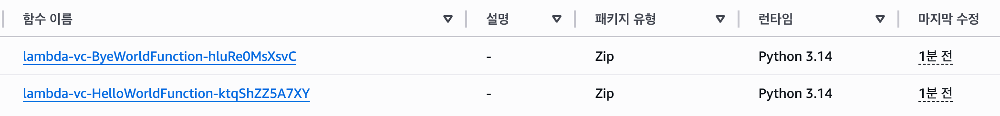
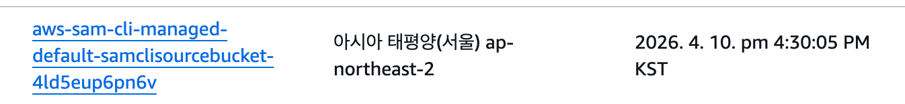

# Multiple AWS lambda version control with AWS SAM
# 다중 람다 버전 관리 CI/CD 환경 구현

## 실행 전 build 방법
sam build --use-container

## 각 Function 실행
sam local invoke [함수명]

실행결과

{"statusCode": 200, "body": "{\"message\": \"hello world\"}"}

{"statusCode": 200, "body": "{\"message\": \"bye world\"}"}

## 배포 방법
sam deploy --guided

단순 반영 후

s3에 버킷 자동생성된 모습

## 템플릿 및 Cloudformation Stack 명 지정해서 람다 배포하기
### package
sam package \
--template-file .aws-sam/build/template.yaml \
--output-template-file [template name] \
--s3-bucket [s3 bucket name] \
--s3-prefix original

### cp (s3에 template 파일 이름 지정해서 업로드)
aws s3 cp [template name] [s3 uri]

### deploy
sam deploy \
--template-file [template name] \
--stack-name [stack name] \
--capabilities CAPABILITY_NAMED_IAM CAPABILITY_AUTO_EXPAND

### rollback
aws cloudformation update-stack \
--stack-name [stack name] \
--template-url [template uri]
--capabilities CAPABILITY_NAMED_IAM CAPABILITY_AUTO_EXPAND